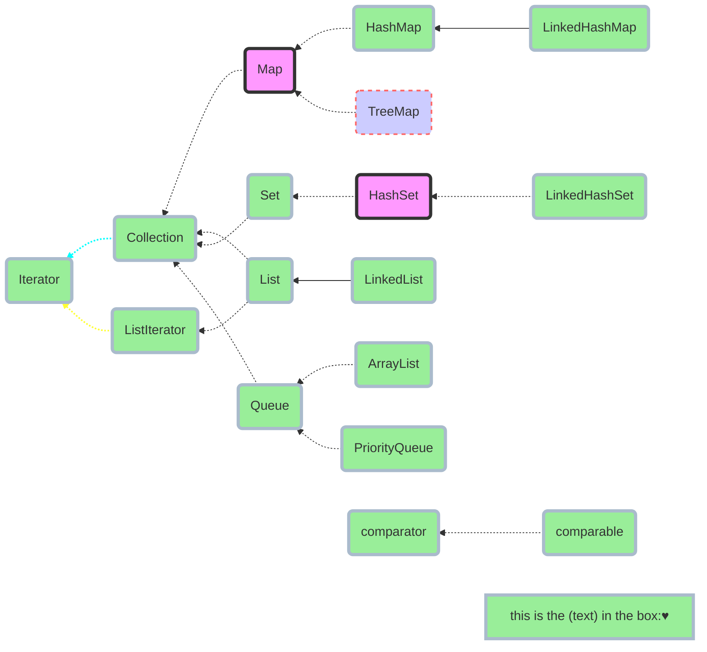

```mermaid
graph RL
	collection(Collection)-.->iterator(Iterator)
	map(Map)-.->collection(Collection)
	listIterator(ListIterator)-.->iterator(Iterator)
	list(List)-.->listIterator(ListIterator)
	list(List)-.->collection(Collection)
	set(Set)-.->collection(Collection)
	queue(Queue)-.->collection(Collection)
	hashmap(HashMap)-.->map(Map)
	treemap(TreeMap)-.->map(Map)
	arraylist(ArrayList)-.->queue(Queue)
	linkedlist(LinkedList)-->list(List)
	priorityqueue(PriorityQueue)-.->queue(Queue)
	linkedhashmap(LinkedHashMap)-->hashmap(HashMap)
	hashset(HashSet)-.->set(Set)
	comparable(comparable)-.->comparator(comparator)
	linkedhashset(LinkedHashSet)-.->hashset(HashSet)
	%% iterator<--collection
	
	%% 样式
	%% 连线的样式linkStyle
	linkStyle 0 stroke:#0ff,stroke-width:2px
	linkStyle 2 stroke:#ff3,stroke-width:2px
	%% 图像的样式
	style map fill:#f9f,stroke:#333,stroke-width:4px
	style treemap fill:#ccf,stroke:#f66,stroke-width:2px,stroke-dasharray: 5, 5
	
	%% 样式类,定义样式类
	classDef className fill:#f9f,stroke:#333,stroke-width:4px;
	classDef default fill:#9e9,stroke:#abc,stroke-width:4px;
	%% 应用样式类，
	class hashset className
	d1["this is the (text) in the box:#9829;"]
	%% 图标
```

