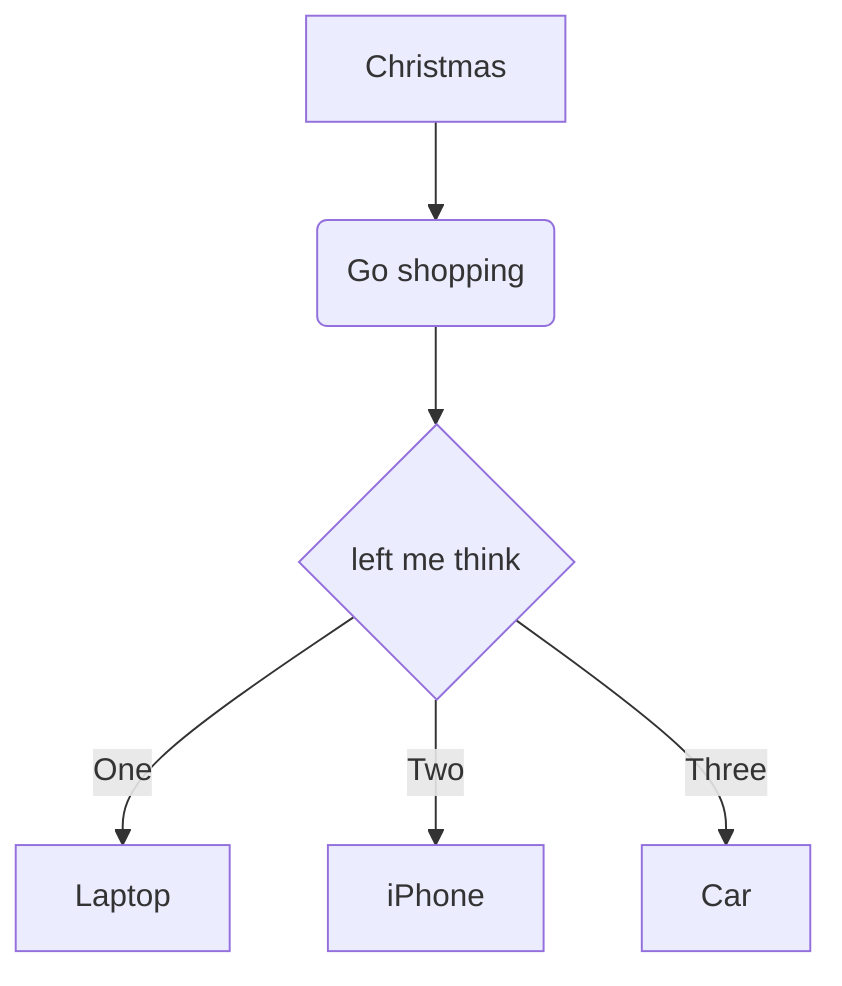
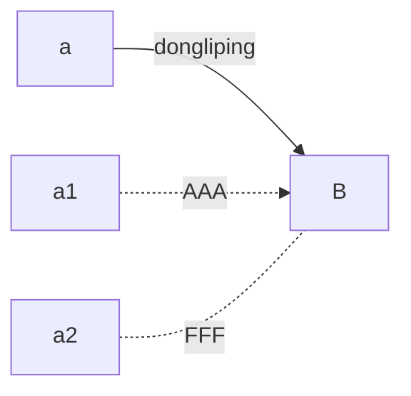
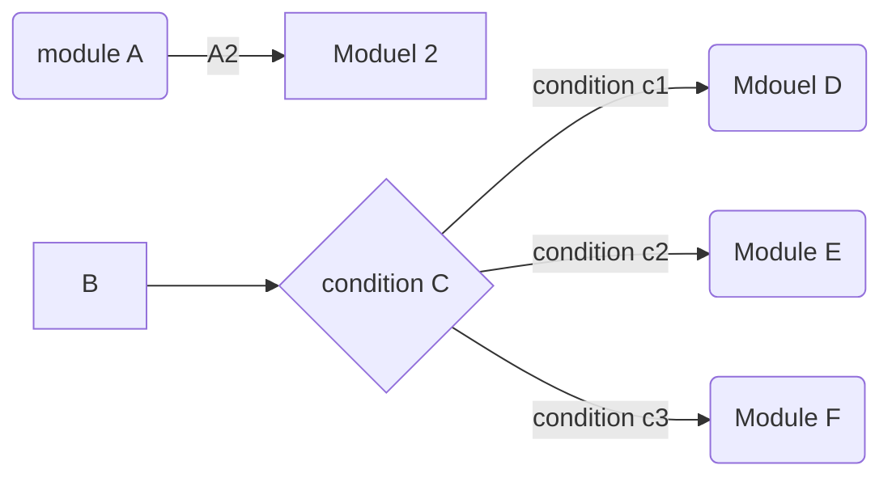
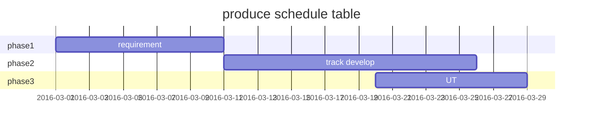
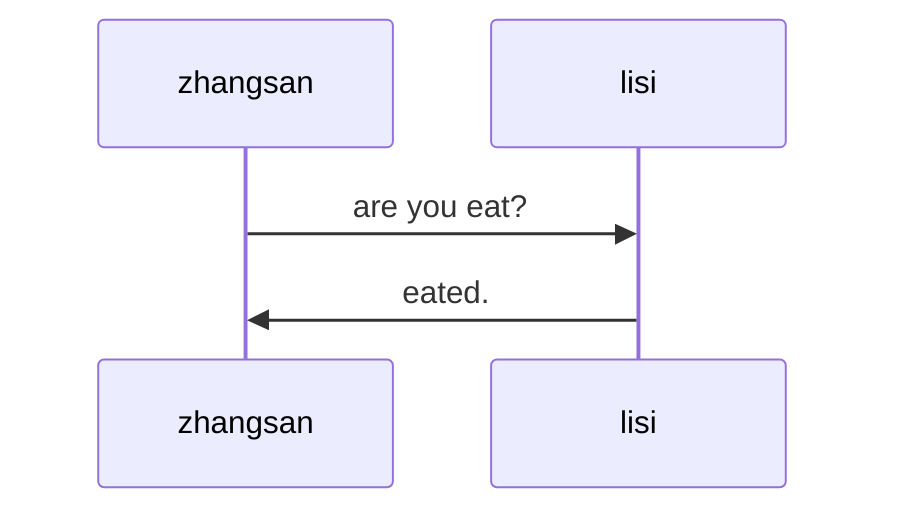
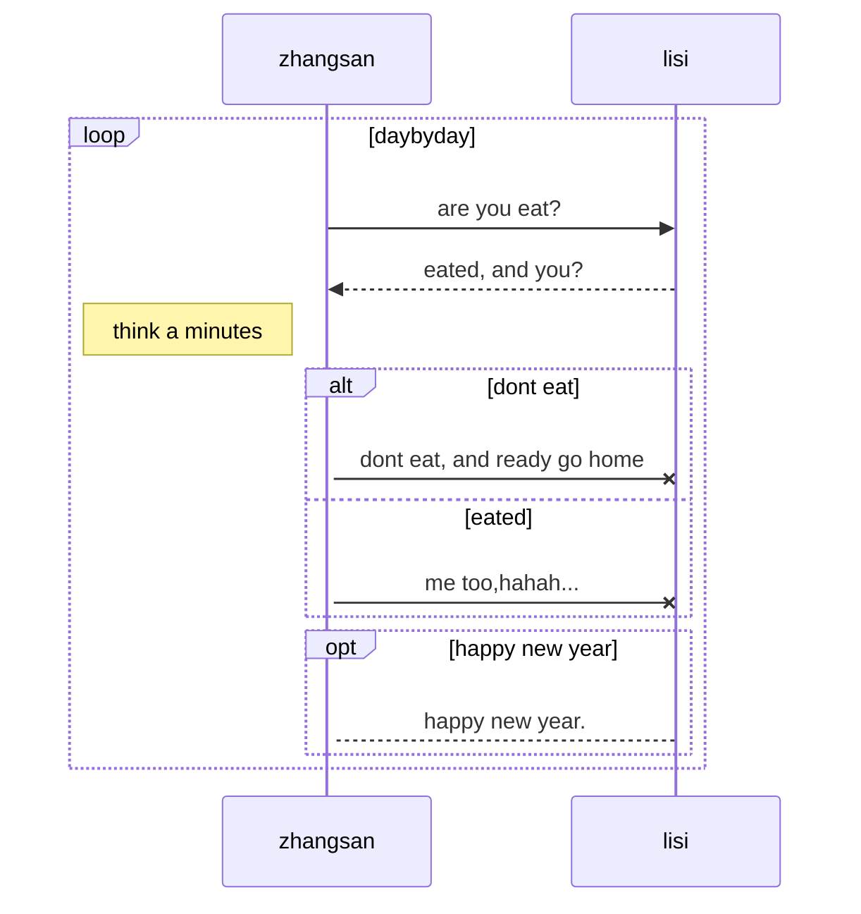
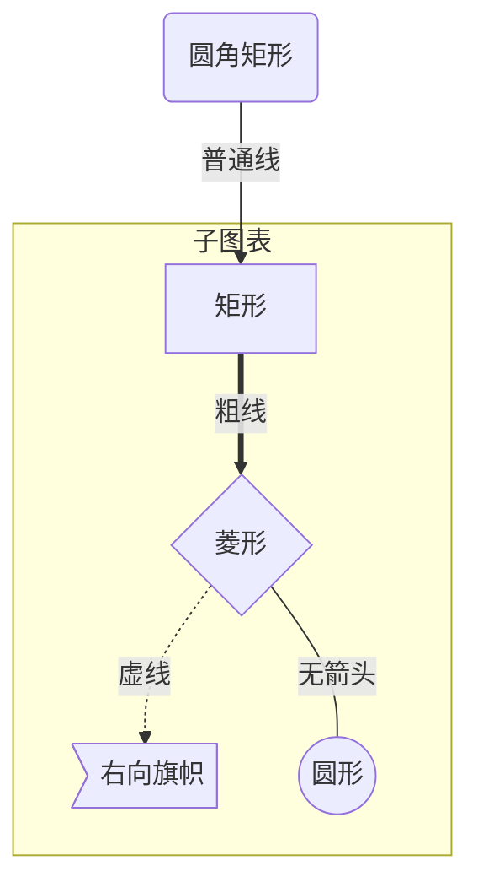
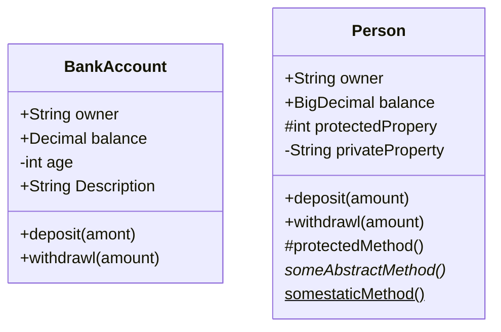
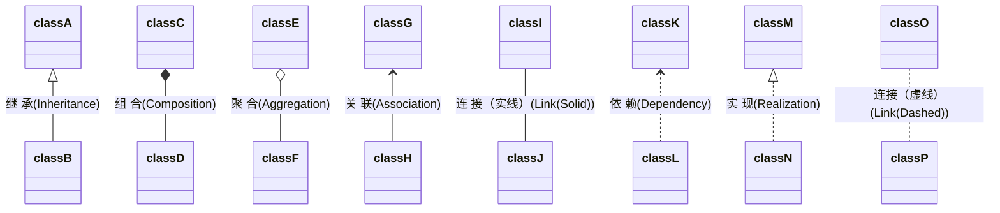

## Markdown 使用Mermaid

link https://mermaid-js.github.io/mermaid/#/gantt

> TB : top button(至上而下)  
>
> BT : button top (之下而上)  
>
> RL : right left (从右到左)  
>
> LR : left right(从左到右)


### 流程图

代码

``` javascript
graph TD
	A[Christmas] --> B(Go shopping)
	B --> C{left me think}
	C --> |One|D[Laptop]
	C --> |Two| E[iPhone]
	C --> |Three| F[Car]
	// 对框线形状的调整
	A1[这是直角四边形]
	A2(这是圆角四边形)
	B1((圆形))
	C1{菱形}
```






## nihao

> wozaiganshenme

```java
public class Program
{
    public static void main(String[] args){
        System.out.println("Hello,world");
    }
}
```

## 流程图(flow chart)



## 序列图(Sequence)

```sequence
title:three sequence
participant 小王
participant 小李
participant 小异常
note left of 小王:我是小王
note over 小李:我是小李
note right of 小异常:大家好！\n我是小异常
小王->小王:小王想:今天要去见两个好朋友~~
小王->小李:嘿，小李好久不见啊~~
小李-->小王:yes!
小李->小异常:小异常，你好！
小异常-->小王:哈，小王！\n最近身体怎么样了？
小王->>小异常:还可以吧
```

- [x] 已完成
  - [x] a
  - [ ] b
- [ ] f
- [ ] g


### 甘特图








### 标注

| 表述     | 含义                       |
| -------- | -------------------------- |
| right of | 右侧                       |
| left of  | 左侧                       |
| over     | 在当中，可以横跨多个参与者 |

### 消息线

| 类型 | 描述                    |
| ---- | ----------------------- |
| ->   | 无箭头的实线            |
| -->  | 无箭头的虚线            |
| ->>  | 有箭头的实线            |
| -->> | 有箭头的虚线            |
| -x   | 末端为×的实线(表示异步) |
| --x  | 末端为×的虚线(表示异步) |

### 处理中

在消息线末尾增加+,则消息接受这进入当前消息的“处理中”状态；  

在消息线末尾增加-, 则消息接收者离开当前消息'处理中'状态。

或者使用以下语法直接说明某个参与者进入“处理中”状态

active 参与者

### 循环

```javascript
loop 循环条件
	循环体描述语句
end
```

### 判断

```javascript
alt condition1_description
	branch 1 description
else condition2_descritpion
	branch 2 decription
end
```

如果遇到可选情况，即没有else分支情况，使用下面语法

```javascript
opt condition1
	branch description statement.
end
```

### 图表方向

| 用词 | 含义                |
| ---- | ------------------- |
| TB   | top buttom 从上到下 |
| BT   | buttom top 从下到上 |
| RL   | right left          |
| LR   | left right          |

### 节点定义

|   表述   |   说明   |
| :------: | :------: |
| id[文字] | 矩形节点 |
| id(文字) | 圆角矩形节点 |
| id((文字)) | 圆形节点 |
| id>文字] | 右向旗帜状节点 |
| id{文字} | 菱形节点 |

### 节点间的连线

|   表述   |      说明      |
| :------: | :------------: |
|    >     |  添加尾部箭头  |
|    -     | 不添加尾部箭头 |
|    --    |      单线      |
| --text-- |   单线加文字   |
|    ==    |      加粗      |
| ==text== |   粗线加文字   |
|   -.-    |      虚线      |
| -.text.- |   虚线加文字   |



### Class Diagrams






