```flow
sta=>start: 开始
e=>end: 结束
op=>operation: 操作（处理块）
sub=>subroutine: 子程序
cond=>condition: 是或者不是（条件判断）?
cond2=>condition: 第二个判断（条件判断）?
io=>inputoutput: 输出

sta->op->cond
cond(yes)->e
cond(no)->cond2
cond2(yes,right)->sub(left)-op
cond2(no)->io(lef)->e
```

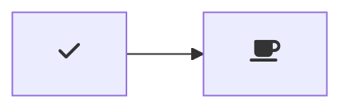

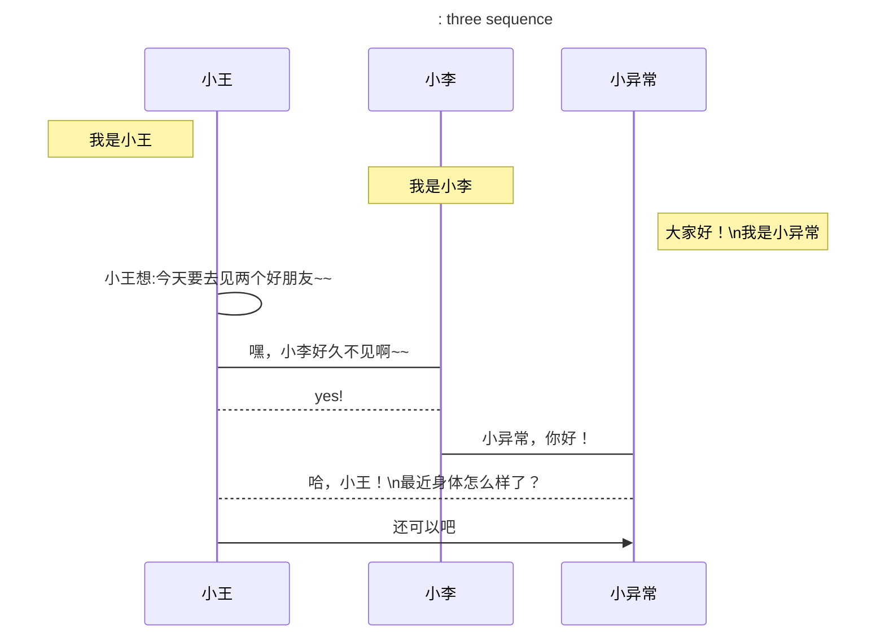

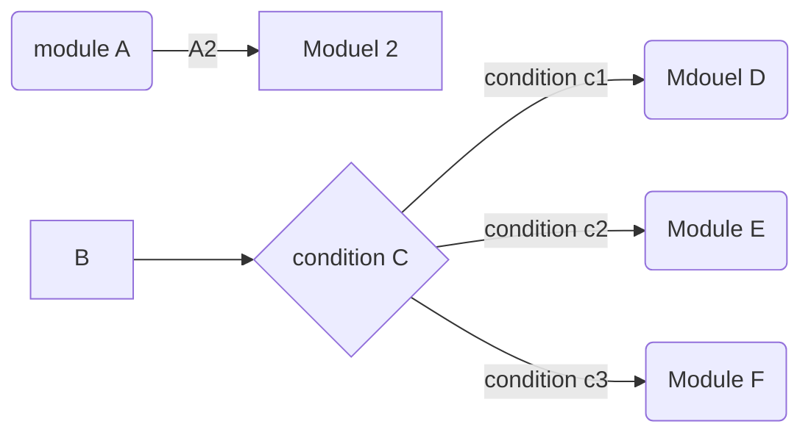

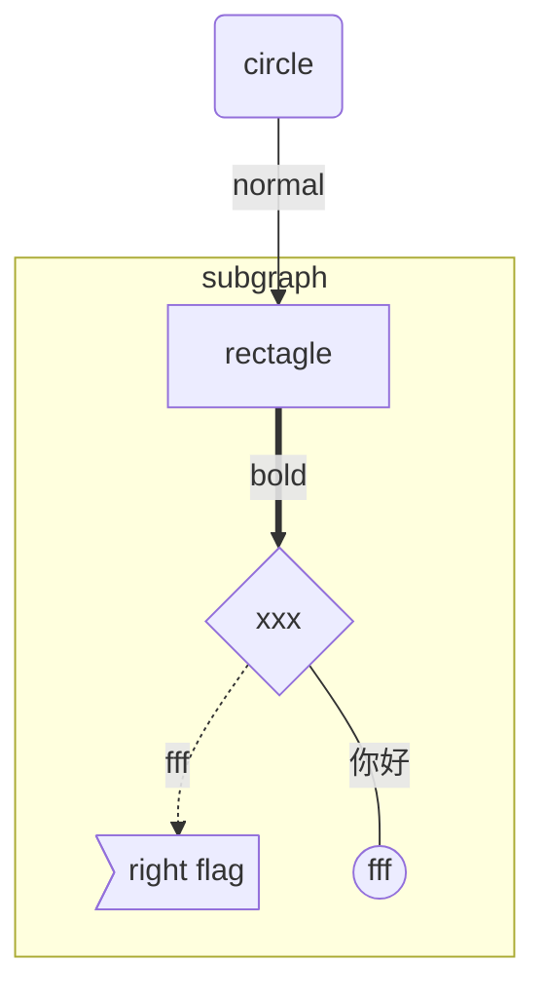

### class graph
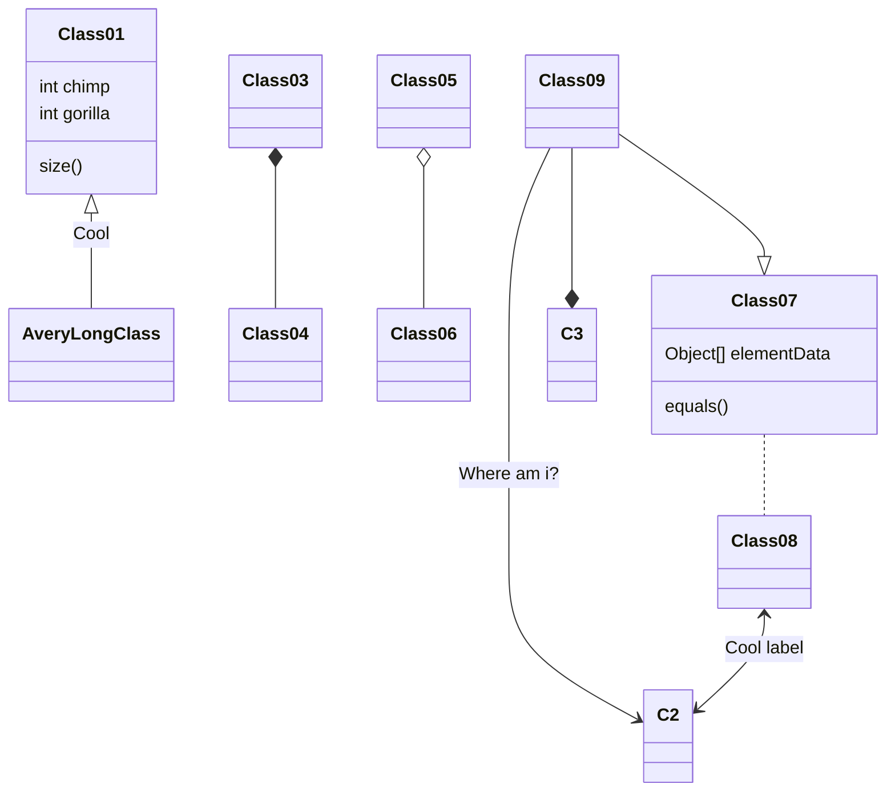

### Git graph 


### Gantt Diagram

#### Sytax
```javascript
gantt
       dateFormat  YYYY-MM-DD
       title Adding GANTT diagram functionality to mermaid

       section A section
       Completed task            :done,    des1, 2014-01-06,2014-01-08
       Active task               :active,  des2, 2014-01-09, 3d
       Future task               :         des3, after des2, 5d
       Future task2              :         des4, after des3, 5d

       section Critical tasks
       Completed task in the critical line :crit, done, 2014-01-06,24h
       Implement parser and jison          :crit, done, after des1, 2d
       Create tests for parser             :crit, active, 3d
       Future task in critical line        :crit, 5d
       Create tests for renderer           :2d
       Add to mermaid                      :1d

       section Documentation
       Describe gantt syntax               :active, a1, after des1, 3d
       Add gantt diagram to demo page      :after a1  , 20h
       Add another diagram to demo page    :doc1, after a1  , 48h

       section Last section
       Describe gantt syntax               :after doc1, 3d
       Add gantt diagram to demo page      :20h
       Add another diagram to demo page    :48h
```
#### Example
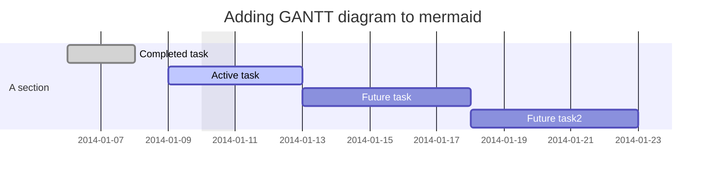

### Sequence Diagram
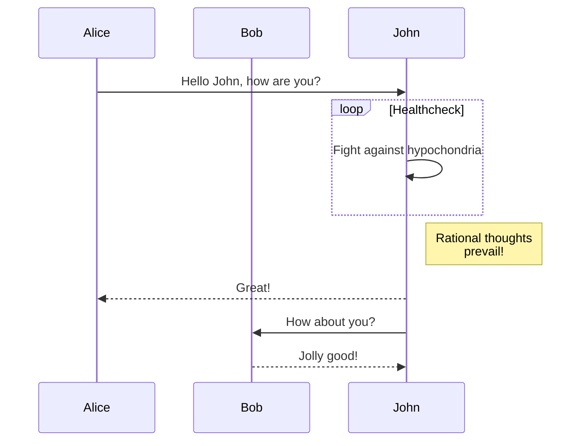

### Flowchart


### State Diagrams
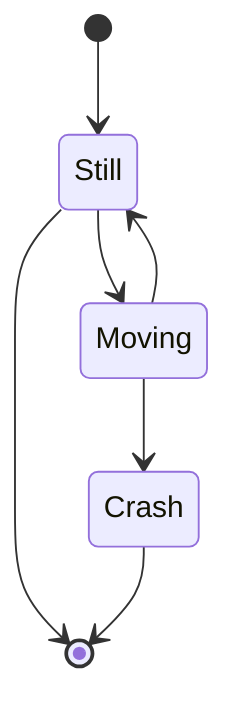

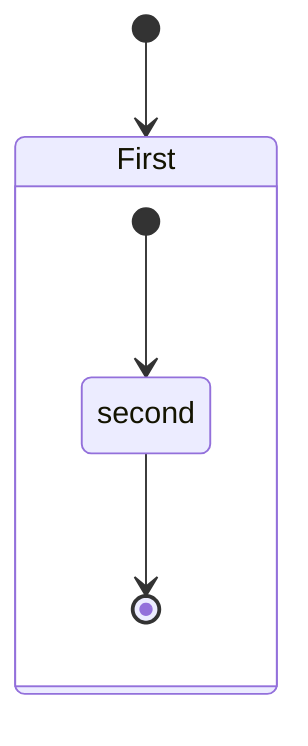

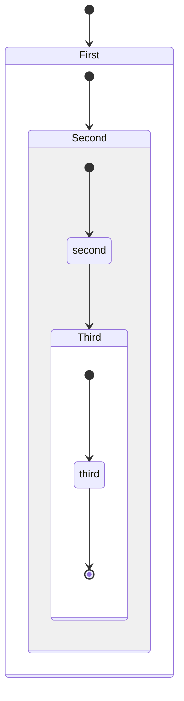

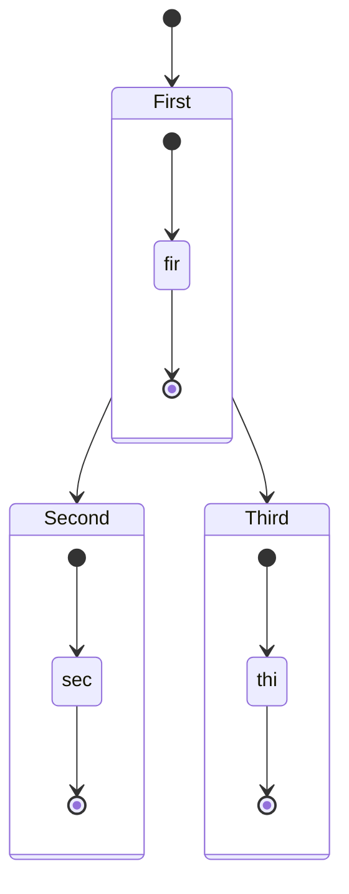

### Pie chart diagrams
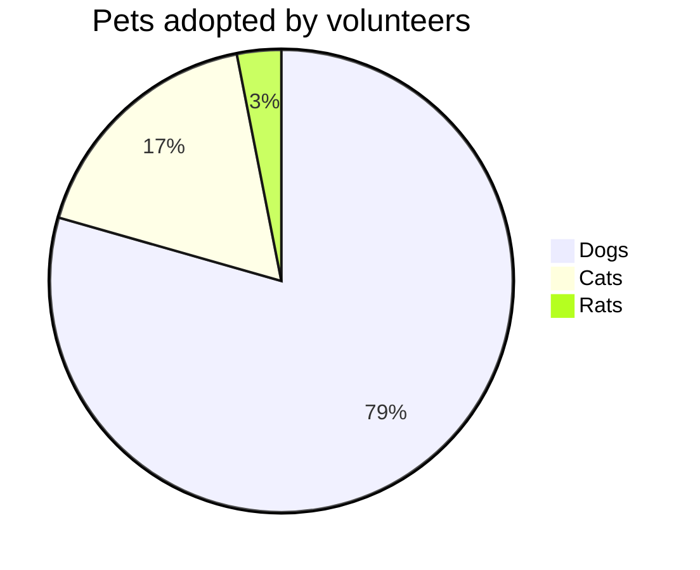

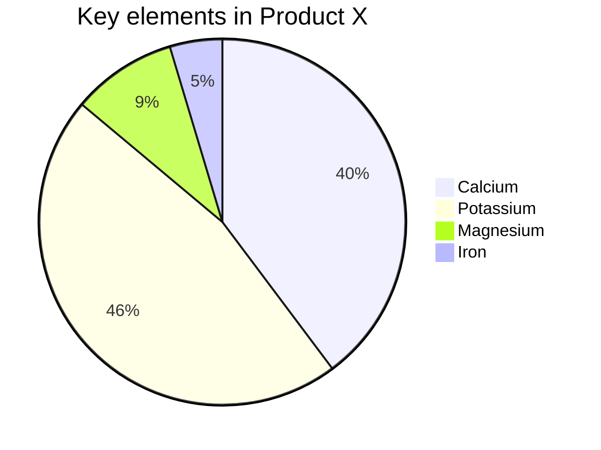
#### Syntax
```javascript
[pie] [title] [titlevalue] (OPTIONAL)
"[datakey1]" : [dataValue1]
"[datakey2]" : [dataValue2]
"[datakey3]" : [dataValue3]
```

#### Example
